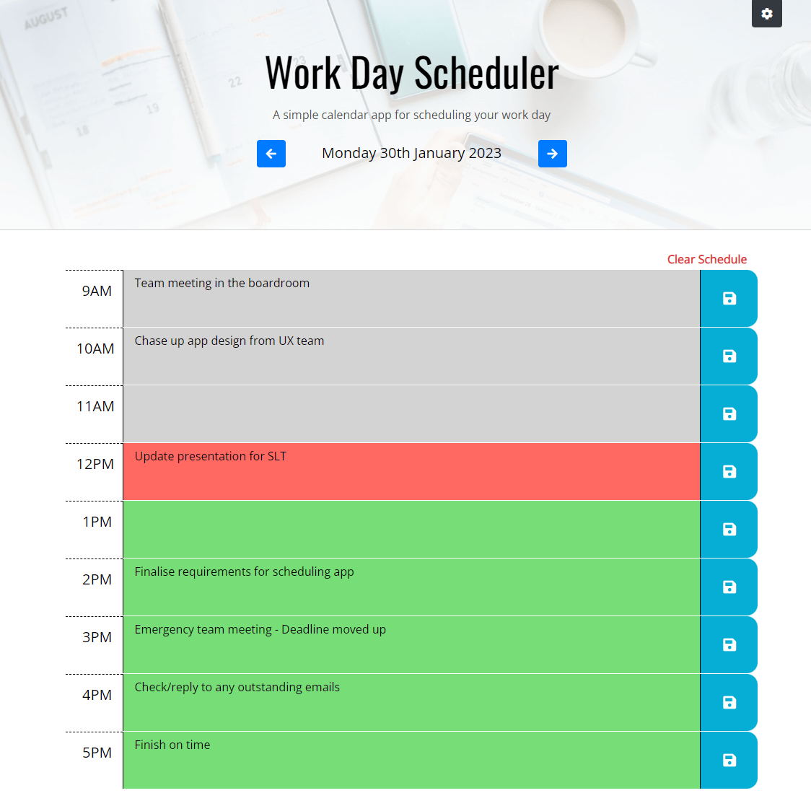

# Third-Party APIs: Work Day Scheduler

## Description

I was tasked with creating a simple calendar application that allows a user to save events for each hour of the day.

### User Story

```
AS AN employee with a busy schedule
I WANT to add important events to a daily planner
SO THAT I can manage my time effectively
```

### Acceptance Criteria

The app should:
- Display the current day at the top of the calender when a user opens the planner.
- Present timeblocks for standard business hours when the user scrolls down.
- Color-code each timeblock based on past, present, and future when the timeblock is viewed.
- Allow a user to enter an event when they click a timeblock
- Save the event in local storage when the save button is clicked in that timeblock.
- Persist events between refreshes of a page

The application will be completed when all of the above criteria are met. The app will run in the browser and will feature dynamically updated HTML and CSS powered by JQuery code. It will utilise the Moment.js library to work with dates and times.

## Table of contents
- [Installation](#installation)
- [Usage](#usage)
- [Credits](#credits)
- [License](#license)

## Installation
N/A

## Usage
- [Deployed Application](https://trunten.github.io/ubbc-work-day-scheduler/)
- JavaScript is required for the site to function (make sure it is enabled).
    - noscript tag included to alert the user that JavaScript is required.
- Click into any time slot and begin typing to add/edit tasks.
- Unsaved items will be indicated by an orange highlighted save button.
- Click on the save button to the right of each time block to save any pending additions or amendments
- Change the selected day using the left/right arrow buttons in the page header
    - Jump back to today at any point by clicking on the "Back to Today" link
- Clear the schedule for the currently selected day by clicking the "Clear Schedule" link
- Display settings can be changed at any time by clicking the settings button (top right of page).
- App will alert you to any unsaved changes if you try and leave the site or update the selected date.

Application Screenshot:

[](https://trunten.github.io/ubbc-work-day-scheduler/)


## Credits
- Calendar background image: [Windows](https://unsplash.com/@windows?utm_source=unsplash&utm_medium=referral&utm_content=creditCopyText) on [Unsplash](https://unsplash.com/photos/SwHvzwEzCfA?utm_source=unsplash&utm_medium=referral&utm_content=creditCopyText)
- Calendar favicon: https://icons8.com/

## License
Please refer to the [LICENSE (MIT)](LICENSE) in the repo.


